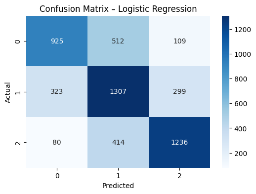
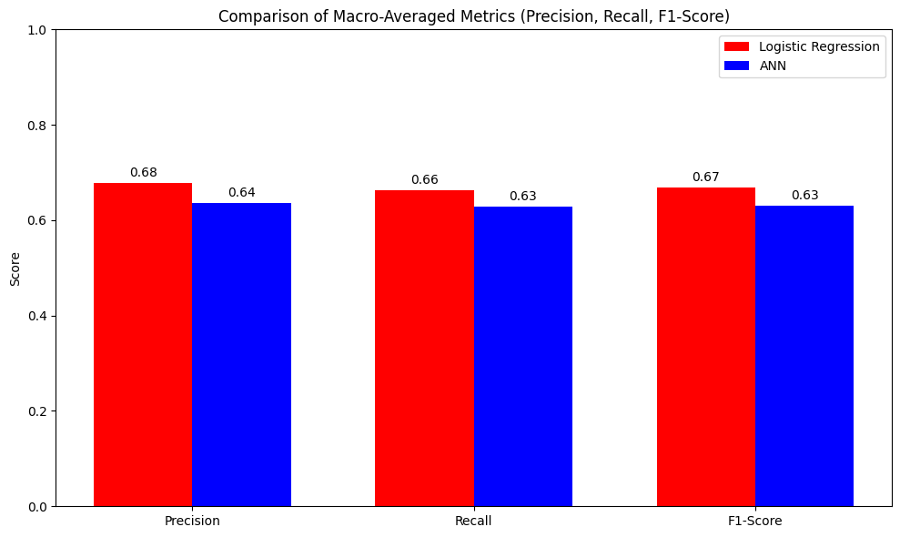

<div align="center">

# 🎭 Sentiment Classification MLA


<br>

A comprehensive **Machine Learning** project comparing **Logistic Regression** and **Artificial Neural Networks (ANN)** for multi-class sentiment analysis.  
Classifies text into **Positive**, **Neutral**, and **Negative**.

</div>

---

## 🚀 Features

*   **TF-IDF Vectorization**: ⚡ Efficient feature extraction.
*   **Model Comparison**: ⚖️ Logistic Regression vs. Multi-Layer Perceptron (MLP).
*   **Visualizations**: 📊 Confusion matrices and accuracy charts.
*   **Interactive Testing**: 💬 Test with your own input sentences.
*   **Automated Data Pipeline**: 🔄 Seamless Hugging Face integration.

## 📂 Project Structure

```bash
├── dataset/
│   ├── download_data.py    # Download script
│   └── create_dataset.py   # Processing script
├── main.ipynb              # 📓 Jupyter Notebook (Training & Analysis)
├── train_df.csv            # Training data
├── val_df.csv              # Validation data
├── test_df.csv             # Testing data
└── README.md               # Documentation
```

## 🛠️ Installation

### 1. Clone & Setup
```bash
git clone https://github.com/cserishav-cmd/Sentiment-Classification-MLA-.git
cd Sentiment-Classification-MLA-
```

### 2. Install Dependencies
```bash
pip install scikit-learn pandas numpy matplotlib seaborn huggingface_hub datasets
```

## 📊 Dataset

The project uses the **[Sp1786/multiclass-sentiment-analysis-dataset](https://huggingface.co/datasets/Sp1786/multiclass-sentiment-analysis-dataset)** from Hugging Face.

### Quick Setup
To download and process the data:
```bash
python dataset/download_data.py
python dataset/create_dataset.py
```

## 🧠 Model Performance

| Model | Test Accuracy |
| :--- | :--- |
| **Logistic Regression** | **~67%** |
| **ANN (MLP)** | ~63% |

> *Note: Results may vary slightly due to random initialization.*

### 📷 Visuals

<p align="center">
  
  
</p>

## 💻 Usage

1.  Open `main.ipynb` in **Jupyter Notebook** or **VS Code**.
2.  Run all cells to train and evaluate.
3.  **Interact**: Scroll to the bottom to test custom sentences!

    ```text
    Input:  "The movie was fantastic!"
    Output: Positive
    ```

## 🤝 Contributing

Contributions are welcome! Feel free to open an issue or submit a pull request.

---

<p align ="center">Made with ❤️ for ML Enthusiasts</p>